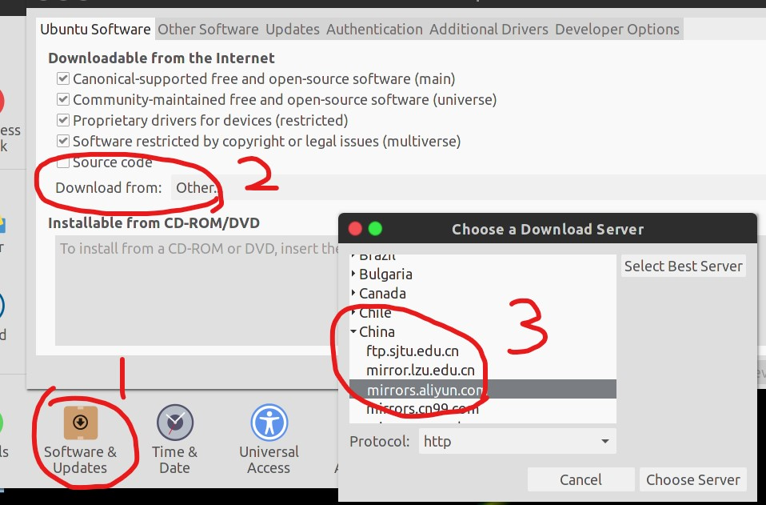
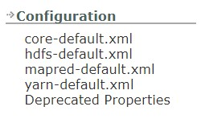

# 大数据组件Hadoop与Spark的搭建

---

*Apache基金会拥有庞大的大数据生态组件，其中Hadoop和Spark都是顶级项目，也是大数据生态的核心组件。*

## 操作系统

### 简要介绍

大数据组件一般是运行于Linux内核的操作系统上，Linux的发行版有很多，做实验选择自己喜欢的就好；一般推荐CentOS或Ubuntu，安装环境无论是原生Linux还是虚拟机都可。

> CentOS（Community ENTerprise Operating System）是Linux发行版之一，它是来自于Red Hat Enterprise Linux依照开放源代码规定释出的源代码所编译而成。由于出自同样的源代码，因此有些要求高度稳定性的服务器以CentOS替代商业版的Red Hat Enterprise Linux使用。

> Ubuntu是一个以桌面应用为主的Linux操作系统。Ubuntu基于Debian发行版和GNOME桌面环境，与Debian的不同在于它每6个月会发布一个新版本。Ubuntu的目标在于为一般用户提供一个最新的、同时又相当稳定的主要由自由软件构建而成的操作系统。Ubuntu具有庞大的社区力量，用户可以方便地从社区获得帮助。

[Linux系统之CentOS和Ubuntu的区别](https://cloud.tencent.com/developer/article/1457753)

我个人使用的是Vmware Workstaion + Ubuntu 16.04，后面截图以此作为演示

### 需要熟悉的工具和命令

在Linux环境下更多是用bash操作，所以熟知一些命令和工具是必需的。

---**以Ubuntu系统为示例**---

- **Linux系统区分大小写**，所以命令不正确时检查大小写

- 包管理系统
  - Ubuntu使用优秀的包管理系统，常用的有apt和dpkg，对应的CentOS系统上为yum和rpm
  - 在使用包管理系统前需要换源，默认源在国外速度慢；可以更改`/etc/apt/sources.list`，更简单的方法是系统设置->软件与更新->下载->找到中国的服务器
  
  - 常用命令，都需要加上`sudo`
    - `apt-get update`：从源更新最新的软件目录名单
    - `apt-get upgrade`：更新系统内的软件
    - `apt-get install xxxxxx`：安装某个软件，会自动解决依赖问题

- sudo
  默认使用的用户是普通用户，没有root权限，在需要root权限执行的命令前加上`sudo`并输入用户密码即可在运行过程中获得root权限，注意在Linux系统下输入密码是默认不可见的，没有******号

- vi/vim
  无图形界面的编辑器，很多时候需要对配置文件进行修改，但是又只有bash，所以vi/vim的使用是必不可少，vi与vim略有不同，参考[vi与vim使用与区别](https://blog.csdn.net/J080624/article/details/69544064)，实际使用可以当作一回事；需要注意的是，vi/vim的操作逻辑与平常的编辑器不太相同，建议查看[十分钟学会 Vim 基本操作](https://www.jianshu.com/p/ec5910c93d69)和[vi/vim基本使用方法](https://www.cnblogs.com/itech/archive/2009/04/17/1438439.html)进行学习

- ping
  搭建集群有时需要测试机器是否处于同一个网络下，ping命令的安装`sudo apt-get install iputils-ping`

- ifconfig
  查看本机IP等网络信息使用的命令是`ifconfig`，安装命令为`sudo apt-get install net-tools`

- ssh
  - Hadoop集群的运行依赖于SSH，它是一个可用于远程登陆的协议，具体来说使用`ssh 被访问用户名@IP地址`命令再输入被访问用户的密码即可实现登陆
  - 安装SSH服务端`sudo apt install openssh-server`，会自动安装SSH客户端`openssh-client`
  - 开启停止重启查看服务状态`service ssh/sshd start|stop|restart|status`，`ssh`表示客户端服务，`sshd`表示服务端服务，一般来说全部打开即可，d表示daemon，即守护进程
  - 测试SSH服务往往使用`ssh 当前用户名@localhost`命令，可以成功进入表示SSH功能正常
  - SSH客户端的配置文件`/etc/ssh/ssh_config`，配置文件[详解](https://blog.csdn.net/JimyJimang/article/details/10406523)；SSH服务端的配置文件`/etc/ssh/sshd_config`，配置文件[详解](https://blog.51cto.com/xujpxm/1717862)
  - 正常的SSH登陆需要每次输入密码，更简便的方式有免密登陆，利用非对称加密的原理，创建公钥与私钥，将公钥复制到被访问机器上，即可完成免密登陆，参考[SSH 免密登录是怎么玩儿的?](https://zhuanlan.zhihu.com/p/28423720)和[ssh免密登录配置](https://blog.csdn.net/m0_37590135/article/details/74275859)

- Java
  Linux下建议使用OpenJDK，安装命令`sudo apt-get install openjdk-8-jdk`

- cd
  更换目录，一个`.`表示当前目录，两个`.`表示上一级目录
  > $cd ..    
  //返回上层目录

- ls
  列出当前目录内的文件信息，`ls -al`查看详细的信息

- 使用`Tab`键可以快速补全命令

- 路径(Path)
  - Linux的根目录表示为`/`，当前用户的目录表示为`~`.
  - 如可用`cd /`进入系统的根目录，使用`cd ~`进入当前用户的目录
  - 如果被操作目录路径第一个字符为`/`则表示绝对路径，否则表示相对路径。比如处于当前目录`/home/user`，想进入`mydir`目录，应该使用`cd mydir`命令，如果使用`cd /mydir`，则会从系统的根目录访问`mydir`，而这个文件夹是不存在的

## Hadoop

### 简要介绍

Apache Hadoop是一个允许在集群上使用简单编程模型对大量数据进行分布式处理的软件库。它被设计为可以从单机拓展到上千台机器，并且每台机器提供本机的计算和存储能力。与其依赖于硬件的高稳定性，Hadoop系统自身被设计为在应用层可以探测和处理各种错误，所以在一个集群上可以提供高可用的服务。

[官网](https://hadoop.apache.org/)

Hadoop系统主要涉及的组件：
- Hadoop Common：支撑其他Hadoop组件运行的普通组件
- Hadoop Distributed File System(HDFS)：分布式文件系统，*可以单独作为很多应用支持的底层文件存储系统*，比如Spark
- Hadoop YARN：作业调度和集群资源管理的框架
- Hadoop MapReduce：基于YARN用作大量数据并行处理的系统

### Hadoop1与Hadoop2

如果上过大数据基础课程，应该大致了解Hadoop的工作流程。

需要指出的是，早期Hadoop1和如今主流使用的Hadoop2架构设计已经发生很大变化，参考下面两篇文章
- [Hadoop 1.x和2.x区别和联系](https://blog.csdn.net/pao___pao/article/details/79464184)
- [Hadoop 1与Hadoop 2的区别](https://blog.csdn.net/simonqian_vip/article/details/20358169)

> Hadoop 1.0即第一代Hadoop，由分布式存储系统HDFS和分布式计算框架MapReduce组成，其中，HDFS由一个NameNode和多个DataNode组成，MapReduce由一个JobTracker和多个TaskTracker组成，对应Hadoop版本为Apache Hadoop 0.20.x、1.x、0.21.X、0.22.x和CDH3

> Hadoop 2.0针对Hadoop 1.0中的MapReduce在扩展性和多框架支持等方面的不足，它将JobTracker中的资源管理和作业控制功能分开，分别由组件ResourceManager和ApplicationMaster实现，其中，ResourceManager负责所有应用程序的资源分配，而ApplicationMaster仅负责管理一个应用程序，进而诞生了全新的通用资源管理框架YARN,对应Hadoop版本为Apache Hadoop 0.23.x、2.x和CDH4

### Hadoop下载

2.x最新版本为2.9.2，[下载链接](https://hadoop.apache.org/releases.html)，[2.9.2文档](https://hadoop.apache.org/docs/r2.9.2/index.html)，下载`binary`即可，需要学习源码可以单独下载`src`

压缩文件解压后，在`$HADOOP_HOME/share/doc`内是当前版本对应的doc文档，可以用浏览器打开`index.html`直接本地查看

Hadoop[全版本下载](https://archive.apache.org/dist/hadoop/core/)

Hadoop[全版本文档](https://hadoop.apache.org/docs/)

### Hadoop单机安装与环境配置

**官网文档** [Hadoop: Setting up a Single Node Cluster](https://hadoop.apache.org/docs/r2.9.2/hadoop-project-dist/hadoop-common/SingleCluster.html)

此文档是单节点上三种搭建方式的介绍，非常简介，具体为：
1. Local(Standalone)模式，也即直接运行Hadoop
2. Pseudo-Distributed(伪分布式)模式，当前节点既作为Master又作为Worker
3. YARN在单节点部署，之前介绍了，YARN是资源管理和作业调度的程序，我们需要更改配置文件使其在单节点上运行

配置的过程因为比较简单，不再截图给出，第一个参考就是上面的官方文档，第二个是[史上最详细、最全面的Hadoop环境搭建](https://www.javazhiyin.com/25870.html)，有每一步的过程截图，很详细，其中还包含了完全分布式的指导，建议大家一步步来，循序渐进。

### Hadoop完全分布式

**官方文档** [Hadoop Cluster Setup](https://hadoop.apache.org/docs/r2.9.2/hadoop-project-dist/hadoop-common/ClusterSetup.html)

这个文档写的比较详细，主要是针对大规模集群，对于我们布置环境，1主节点1从节点只用参考部分内容即可；总结一下主要在于几个配置文件的设置。

进入$HADOOP_HOME/etc/hadoop
> $HADOOP_HOME表示你的Hadoop文件解压位置，应设置为系统级的环境参数

Hadoop的所有配置文件都位于`$HADOOP_HOME/etc/hadoop`

下面分享我的配置文件，仅供参考，所有参数的含义均在[官网](https://hadoop.apache.org/docs/r2.9.2/index.html)左侧列表最下方


- hadoop-env.sh
  只修改
  ```
  export JAVA_HOME=/usr/lib/jvm/java-8-openjdk-amd64
  ```

- core-site.xml
  ```xml
  <configuration>
      <!--NameNode URI-->
      <property>
          <name>fs.defaultFS</name>
          <!--master是主节点的主机名-->
          <value>hdfs://master:9000/</value>
      </property>
      <!--用来指定临时文件的存放目录-->
      <property>
          <name>hadoop.tmp.dir</name>
          <!--路径可以更改，别忘记创建文件夹-->
          <value>file:/root/hdfs/tmp</value>
      </property>
  </configuration>
  ```
  用于配置Hadoop核心的功能参数

- hdfs-site.xml
  ```xml
  <configuration>
      <!--Namenode存储相关文件的本地路径-->
      <property>
          <name>dfs.namenode.name.dir</name>
          <value>file:/root/hdfs/namenode</value>
      </property>
      <!--Datanode存储相关文件的本地路径-->
      <property>
          <name>dfs.datanode.data.dir</name>
          <value>file:/root/hdfs/datanode</value>
      </property>
      <!--每个文件块在HDFS备份的数量-->
      <property>
          <name>dfs.replication</name>
          <value>2</value>
      </property>
  </configuration>
  ```
  用于配置HDFS相关的参数

- yarn-site.xml
  ```xml
  <configuration>
      <property>
          <name>yarn.nodemanager.aux-services</name>
          <value>mapreduce_shuffle</value>
      </property>
      <property>
          <name>yarn.resourcemanager.hostname</name>
          <value>master</value>
      </property>
  </configuration>
  ```
  用于配置调度系统YARN相关的参数

- mapred-site.xml
  ```xml
  <configuration>
      <property>
          <name>mapreduce.framework.name</name>
          <value>yarn</value>
      </property>
  </configuration>
  ```
  用于配置Map-Reduce过程相关的参数

- slaves
  ```
  master
  worker1
  ```
  master是主节点的主机名，worker1是从节点的主机名。这里slaves文件包含的是工作节点的主机名，如果不要master就只有worker1一个作为工作节点，或者你可以添加worker2等等更多的工作节点。

配置完成后，初始化
> $ bin/hdfs namenode -format

再开启所有进程
> $ sbin/start-all.sh

可用
> $ jps
查看本机相关进程是否成功运行

## Spark的简要介绍


